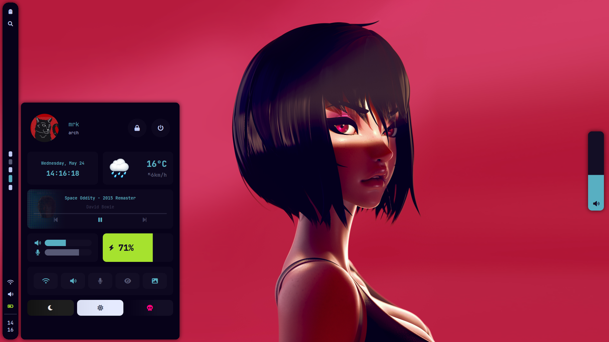
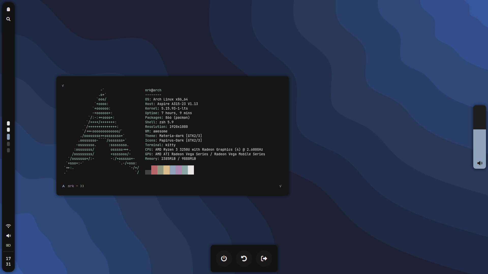
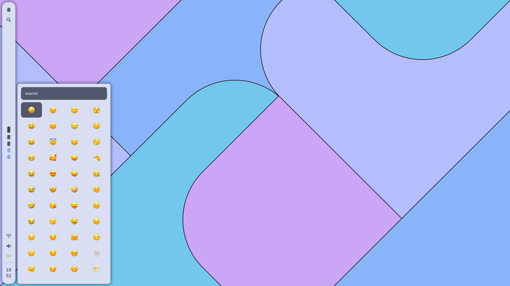

# policromia

<p align="center">
  
  
  
</p>

## Details

- **OS:** [Arch Linux](https://archlinux.org)
- **WM:** [awesome](https://github.com/awesomeWM/awesome)
- **Terminal:** [kitty](https://github.com/kovidgoyal/kitty)
- **Shell:** [zsh](https://www.zsh.org/)
- **Editor:** [neovim](https://github.com/neovim/neovim)
- **Compositor:** [picom](https://github.com/yshui/picom)
- **Application Launcher:** [rofi](https://github.com/davatorium/rofi)
- **Emoji List:** [rofi-emoji](https://github.com/Mange/rofi-emoji)

AwesomeWM Modules:

- **[bling](https://github.com/blingcorp/bling)**
  - Adds new layouts, modules, and widgets that try to focus on window management primarily

### Keys

| Shortcut                                                  | Action                    |
| :-------------------------------------------------------- | :------------------------ |
| <kbd>Super</kbd> + <kbd>d</kbd>                           | Toggle dashboard          |
| <kbd>Super</kbd> + <kbd>e</kbd>                           | Open application launcher |
| <kbd>Super</kbd> + <kbd>Shift</kbd> + <kbd>e</kbd>        | Open emoji list           |
| <kbd>Super</kbd> + <kbd>Shift</kbd> + <kbd>s</kbd>        | Cropped screenshot        |
| <kbd>Super</kbd> + <kbd>t</kbd>                           | Toggle on top             |
| <kbd>Super</kbd> + <kbd>f</kbd>                           | Toggle fullscreen         |
| <kbd>Super</kbd> + <kbd>s</kbd>                           | Toggle floating           |
| <kbd>Super</kbd> + <kbd>Tab</kbd>                         | Focus next                |
| <kbd>Super</kbd> + <kbd>Control</kbd> + <kbd>+</kbd>      | Increase window opacity   |
| <kbd>Super</kbd> + <kbd>Control</kbd> + <kbd>-</kbd>      | Decrease window opacity   |
| <kbd>Super</kbd> + <kbd>Control</kbd> + <kbd>Return</kbd> | Reset window opacity      |

## Setup

Using [paru](https://github.com/Morganamilo/paru) as the AUR helper

### Dependencies

```
paru -S \
    `#core packages` \
    awesome-git picom-git redshift kitty rofi rofi-emoji xclip xorg-xwininfo scrot ttf-jetbrains-mono-nerd noto-fonts noto-fonts-cjk networkmanager betterlockscreen playerctl brightnessctl pipewire pipewire-alsa pipewire-pulse alsa-utils acpi \
    `#extra packages` \
    zsh gvfs thunar lsd zoxide bat fzf lxappearance materia-gtk-theme papirus-icon-theme
```

### Get the repo

```
git clone --recurse-submodules https://github.com/mariod8/dotfiles
cd dotfiles
```

### Install

```
cp -r config/awesome/* ~/.config/awesome
cp -r config/picom/* ~/.config/picom
cp -r config/fontconfig/* ~/.config/fontconfig/conf.d
cp -r config/kitty/* ~/.config/kitty
cp -r config/rofi/* ~/.config/rofi
cp -r fonts/* ~/.local/share/fonts
```
