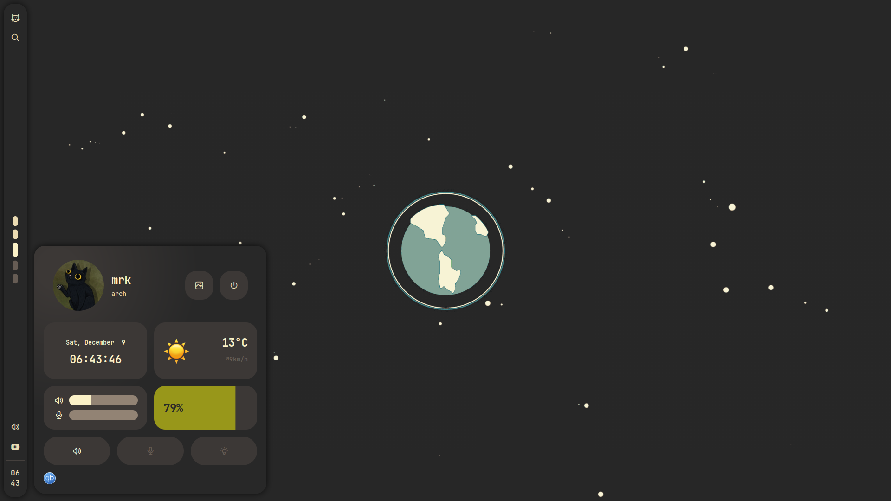
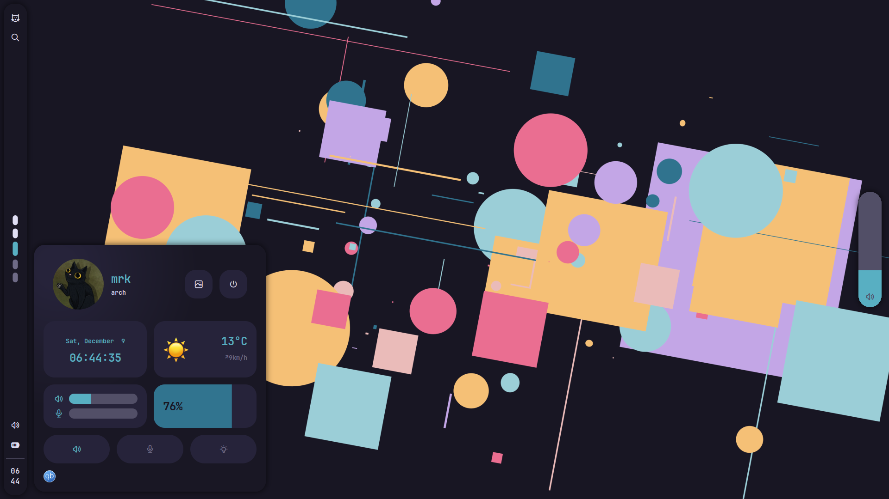
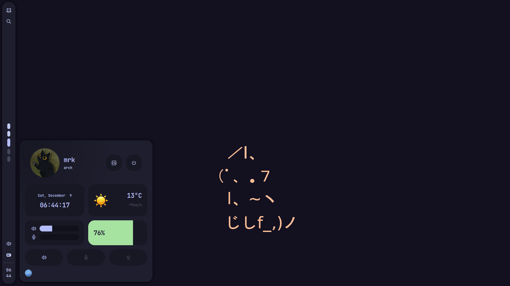

<div align="center">

# policromia

awesomewm setup

</div>

## table of contents

- [details](#details)
- [themes](#themes)
  - [gruvbox](#gruvbox)
  - [rose pine](#rose-pine)
  - [catppuccin](#catppuccin)
    - [add a theme](#add-a-theme)
- [keybindings](#keybindings)
- [setup](#setup)
  - [automatic](#automatic)
  - [manual](#manual)

## details

- os · [arch linux](https://archlinux.org/)
- shell · [zsh](https://www.zsh.org/)
- wm · [awesomewm](https://awesomewm.org/)
- terminal · [kitty](https://sw.kovidgoyal.net/kitty/)
- menus · [rofi](https://github.com/davatorium/rofi)

## themes

### gruvbox

<details>
 <summary>screenshot</summary>
  <p align="center">
    
  </p>
</details>

### rose pine

<details>
 <summary>screenshot</summary>
  <p align="center">
    
  </p>
</details>

### catppuccin

<details>
 <summary>screenshot</summary>
  <p align="center">
    
  </p>
</details>

#### add a theme

themes reside under the directory `.config/awesome/theme/{theme_name}`. Each
theme has a file containing the color scheme imported by a certain application
and a folder named `wallpapers`.

- `colors.lua` · awesomewm
- `colors.rasi` · rofi
- `colors.gtk` · gtk 2/3
- `colors.nvim` · neovim [nvchad](https://github.com/NvChad/NvChad)
- `colors.conf` · kitty

> [!TIP]
> copy an existing theme folder and modify the values in each file accordingly

## keybindings

| Keys                                                      | Action                    |
| :-------------------------------------------------------- | :------------------------ |
| <kbd>Super</kbd> + <kbd>d</kbd>                           | Toggle dashboard          |
| <kbd>Super</kbd> + <kbd>e</kbd>                           | Open application launcher |
| <kbd>Super</kbd> + <kbd>Shift</kbd> + <kbd>e</kbd>        | Open theme switcher       |
| <kbd>Super</kbd> + <kbd>Shift</kbd> + <kbd>s</kbd>        | Cropped screenshot        |
| <kbd>Super</kbd> + <kbd>t</kbd>                           | Toggle on top             |
| <kbd>Super</kbd> + <kbd>f</kbd>                           | Toggle fullscreen         |
| <kbd>Super</kbd> + <kbd>s</kbd>                           | Toggle floating           |
| <kbd>Super</kbd> + <kbd>Tab</kbd>                         | Focus next                |
| <kbd>Super</kbd> + <kbd>Control</kbd> + <kbd>+</kbd>      | Increase window opacity   |
| <kbd>Super</kbd> + <kbd>Control</kbd> + <kbd>-</kbd>      | Decrease window opacity   |
| <kbd>Super</kbd> + <kbd>Control</kbd> + <kbd>Return</kbd> | Reset window opacity      |

## setup

### automatic

> [!NOTE]
> you won't be asked for any customization parameters, so consider tweaking before running

```sh
sh -c "$(curl -fsSL https://raw.githubusercontent.com/mdmrk/policromia/main/install.sh)"
```

### manual

#### dependencies

Using [paru](https://github.com/Morganamilo/paru) as the AUR helper

```sh
paru -S awesome-git picom-git redshift kitty rofi xclip xorg-xwininfo scrot ttf-jetbrains-mono-nerd noto-fonts noto-fonts-cjk networkmanager betterlockscreen brightnessctl pipewire pipewire-alsa pipewire-pulse alsa-utils acpi zsh gvfs thunar lsd zoxide bat lxappearance jq curl p7zip
```

#### clone the repo

```sh
git clone --depth 1 --recurse-submodules --shallow-submodules https://github.com/mdmrk/policromia
cd policromia
```

#### install

```sh
mkdir -p ~/.config/awesome && cp -r config/awesome/* ~/.config/awesome
cp ~/.config/awesome/env.example.lua ~/.config/awesome/env.lua
mkdir -p ~/.config/picom && cp -r config/picom/* ~/.config/picom
mkdir -p ~/.config/kitty && cp -r config/kitty/* ~/.config/kitty
mkdir -p ~/.config/rofi && cp -r config/rofi/* ~/.config/rofi
mkdir -p ~/.local/share/fonts && cp -r fonts/* ~/.local/share/fonts
mkdir -p ~/.themes && 7z x config/gtk/themes.7z -oconfig/gtk && rm config/gtk/themes.7z && cp -r config/gtk/* ~/.themes
chmod +x ~/.config/awesome/scripts/*.sh
```
